# Koi wa Balance - English

English translation for the 1996 Satellaview (an extension of the Super Famicom/Super Nintendo only released in Japan) game Koi wa Balance: Tatoeba K-kun no Tabou na Ichinichi Hen 
The Japanese title (恋はバランス たとえばK君の多忙な一日編) roughly translates to "Love is balance - for example, K's busy day". 

This is a party for up to 4 players in which you play as one of four brothers who are competing in a challenge set up by their dying grand-father, head of the family business. They have to roam the city, pick up girls and take them on dates. The players who gets the most kisses by the end of the game is the new heir of the company.
Despite this weird premise, the game has no sexual content beyond a few innuendos. The main screen says "players 6 and older".

## How to play

From the main screen, there is a Rules menu with explanations on how to play.

The game is played like a board game.  
Players take turns. 
On your turn, you can either move or use an item. 
You move around by spinning a roulette (0 to 4). 

## Spaces

There are different spaces on the board 

Space | Effect
------------ | -------------
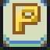 | P space gives you a random gift. (P stands for Present or プレゼント _purezento_ in Japanese)
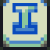 | I space gives you a random item.
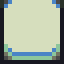 | Empty space triggers a random event which depends on what gifts you have, your current status, your current date, etc.
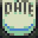 | Date spaces do nothing unless you are dating the right girl. In which case, you get a number of kisses depending on your current status.

You can hold up to 4 gifts and 4 items.

## Dates

At the start of the game, 3 girls will appear on the board. 
All players are "single" at the beginning. 
To pick up a girl, you don't need to land on the same space, you can just walk over that space. 
When you do, the girl will tell you where she wants you to take her. 
The name of your date appears under yours indicating that you are "dating" and no longer "single". (Some items and events have different effects depending on that distinction) 
Take your date to her desired location (You can just walk over it) and you'll score a number of hearts.
After each date, a new girl appears on the board.

Portrait | Sprite | Name | Date
------------ | ------------- | ------------- | ------------- | 
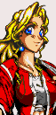 | 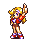 | Kitty | 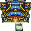  Temple
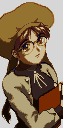 | 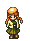 | Autumn | 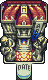  Art Museum
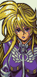 | 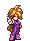 | Holly |   Live House
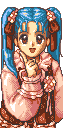 | 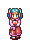 | Robin | 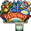  Amusement Park
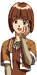 | 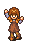 | Nami |   Movie Theater
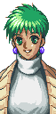 | 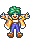 | Karin | 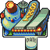  Indoor Ski Slope
 |  | Saya | 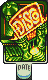  Disco
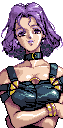 | 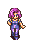 | Yuka | 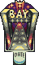  Bay Bridge
 |  | Chiemi |   Swimming Pool
 | 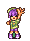 | Mizuho |   Sea
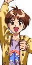 | 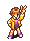 | Kazumi |   Aquarium
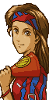 | 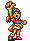 | Kaoru | 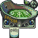  Stadium
? | ? | Bella |   Arena

Bella is a special girl that sometimes appears in place of another one when you pick her up. 

If you stay idle for 20 seconds on the title screen, you can watch a slideshow with information about each girl. 
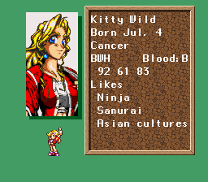

## Game End

The game ends when all 13 girls have been taken on a date.

# Status

Status | Effect
------------ | ------------- |
Sore feet			|Move -1
Fast				|Move +1
Tired				|Can only move 1 space.
On a break			|Skips your turn
Confused			|Loses control
Broke				|No gift from P space.
Silenced			|Can't use items
Christmas			|Extra kisses on a date
Double movement		|Move x2
Invincible			|Cancels one item attack.
Protection			|Dodges one battle

# Items

Name | Effect
------------ | ------------- |
Move 1								|Sets the roulette on 1.		
Move 2								|Sets the roulette on 2.
Move 3								|Sets the roulette on 3.
Move 4								|Sets the roulette on 4.
Time-out			|Forces an opponent to take a break. (Skips turn)
Poor Heart							|Makes an opponent broke. (No gift on P spaces) 
Sore Feet			|Makes an opponent slow. (Move -1) 
Nu's Head							|Makes an opponent tired. (They can only move 1) 
Confusion							|Makes an opponent confused. 
Wheel								|Reverses the play order. 
Gift Tax			|Discards a gift from an opponent. Effect may be doubled. 
Item Tax 		|Discards an item from an opponent. Effect may be doubled. 
Moving Tax		    |		Discards a gift from everyone else. 
Travel Tax			|	Discards an item from a everyone else. 
Gift Exchange			|Exchange a gift with an opponent. No effect if you have none. 
Item Exchange 				|Exchange an item with an opponent. No effect if you have none. 
Switch								|Switches your position with an opponent.
Silver Feet							|Doubles your movement. Play again.
Medicine							|Cures all statuses.
Status Swap							|Exchange your status with an opponent.
Poor Coin							|Makes all opponents broke. (No gift on P spaces) May backfire. 
Curse Coin							|Makes all opponents slow. (Move -1) May backfire. 
Stop Coin							|Forces everyone else to take a break. Sometimes backfires. 
Nu's Coin 						|Makes all opponents tired. (They can only move 1) May backfire. 
King of ♥ 						|Gives you a Christmas effect. (Doubles the hearts on a date) 
Little Brother						|Everyone discards a silver gift. 
Little Sister						|Discards all food gifts from everyone.
Battle Gong							|Triggers a battle with a dating couple. No effect if you are dating. 
Temptation							|Earthly desires make everyone confused.
Wrong Bus							|Warps an opponent randomly on the map. 
Fake Map							|Warps you randomly on the map. 
Gold Shoes							|Makes you move faster. (Move +1) Play again.
Ultima Coin							|Gives everyone else random statuses. May backfire.
Gift Bag 						|See what's inside. 
Gift Bag 							|See what's inside. 
Gift Bag 					|See what's inside. 
Love Potion 					|Improves your seductiveness. (+1 heart on a date) No effect when single. 
Meal Coupon							|Gives you some gifts of type "Food".
Drink Coupon						|Gives you some gifts of type "Drink".
East Wind							|A mahjong tile that warps to the East space. 
South Wind							|A mahjong tile that warps to the South space. 
West Wind							|A mahjong tile that warps to the West space. 
North Wind							|A mahjong tile that warps to the North space. 
Rob 							|Steals a gift from an opponent.
Steal								|Steals an item from an opponent.
Gift Swap							|Exchange all your gifts with an opponent.
Item Swap							|Exchange all your items with an opponent.
Sales Tax 			|Discards a gift from an opponent. May target all gifts. 
Wealth Tax 			|Discards an item from an opponent. May target all items. 
Super Dice							|Doubles your movement and blocks 1 item attack.
Silence								|Silences everyone else. (No item use) May backfire. 
Mall Ticket							|Warps to the Starting space.
Arena Ticket						|Warps to the Pro Wrestling Arena(South West).
1000 cranes							|Children's gift. Status clear and double movement for all single players. 
10 crowns							|Children's gift. Warps you near an opponent and play again. No effect when dating. 
Jealousy							|Makes all the dating couples tired. (They can only move 1) 
564 Dice							|Warps everyone around the map.
Test Item 1							|If anyone is reading this message, it's a bug. Please report it. 
Test Item 2							|If anyone is reading this message, it's a bug. Please report it. 
White Dragon 					|Trades this mahjong tile for an item. If you bring the three dragon tiles on a date... 
Green Dragon 					|Trades this mahjong tile for an item. If you bring the three dragon tiles on a date... 
Red Dragon 						|Trades this mahjong tile for an item. If you bring the three dragon tiles on a date... 
